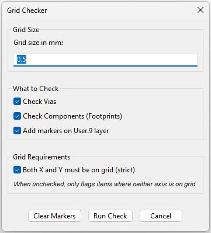
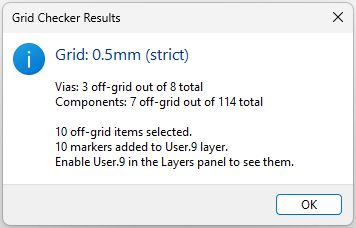

# KiCad Grid Checker Plugin

A KiCad action plugin that checks whether vias and components are positioned on a user-defined grid. Works with KiCad 9 and 10.

## Screenshots

| Options                              | Results                              |
| ------------------------------------ | ------------------------------------ |
|  |  |

## Features

- Check **vias** and/or **footprints** against a configurable grid size (e.g. 0.5mm, 0.25mm, 1.0mm)
- **Strict mode**: both X and Y must be on grid, or **lenient mode**: at least one axis on grid
- Off-grid items are **selected** (highlighted) in the PCB editor
- Optional **persistent visual markers** on the User.9 layer (red circles for vias, blue for components)
- One-click marker cleanup

## Installation

1. Download the latest `CheckGridPlugin-x.x.x.zip` from [Releases](https://github.com/kallaspriit/check-grid-plugin/releases)
2. Open KiCad's PCB Editor
3. Go to **Tools > Plugin and Content Manager**
4. Click **Install from File...** at the bottom
5. Select the downloaded zip file
6. Restart KiCad

### Manual Installation

Alternatively, extract the zip contents into your KiCad scripting plugins directory:

| OS      | Path                                                          |
| ------- | ------------------------------------------------------------- |
| Windows | `Documents\KiCad\9.0\scripting\plugins\CheckGridPlugin\`      |
| Linux   | `~/.local/share/kicad/9.0/scripting/plugins/CheckGridPlugin/` |
| macOS   | `~/Documents/KiCad/9.0/scripting/plugins/CheckGridPlugin/`    |

Replace `9.0` with `10.0` for KiCad 10.

## Usage

1. Open a PCB in KiCad's PCB editor
2. Go to **Tools > External Plugins > Grid Checker** (or click the toolbar button)
3. Configure the grid size, what to check, and checking mode
4. Click **Run Check**

Off-grid items will be selected and optionally marked with colored circles on the User.9 layer. Use the **Clear Markers** button to remove them.

## License

MIT
